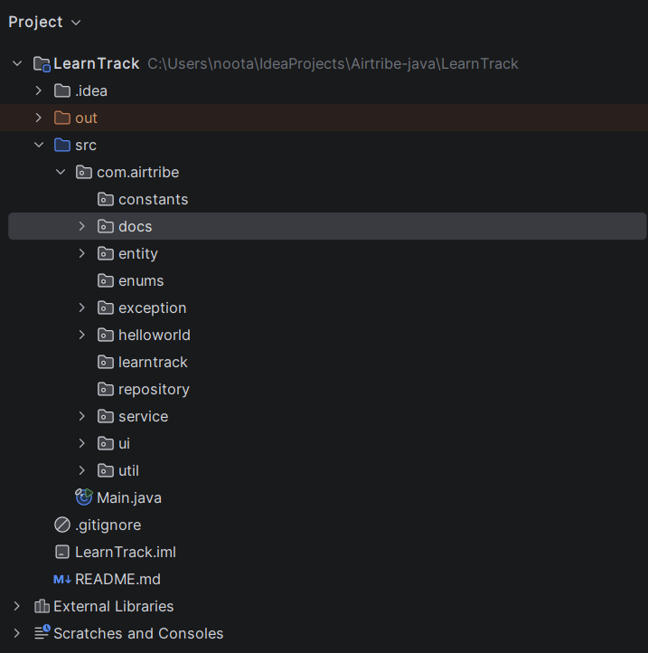
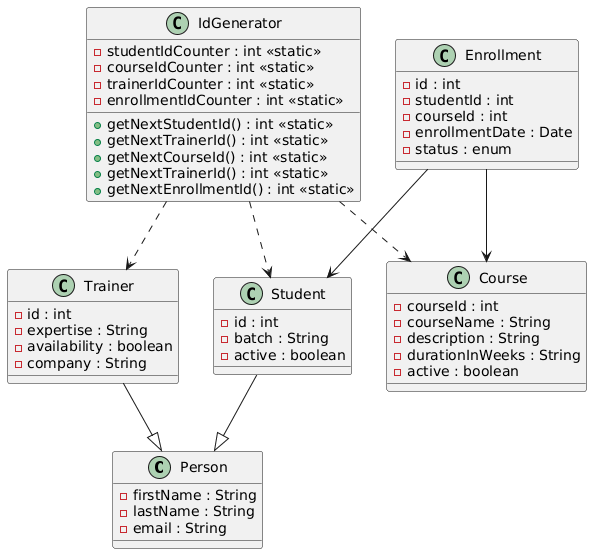

## Project Description
This is a menu-driven console application built using Java.  
The system allows management of Students, Courses, Trainers, and Enrollments.

The application demonstrates core Object-Oriented Programming concepts including:
- Classes and Objects
- Inheritance
- Static members
- Method overloading
- Exception handling
- Clean layered architecture using Service classes

The program runs completely in-memory using ArrayList collections and does not require a database.

---

## Features

### Student Management
- Add new student
- View all students
- Search student by ID
- Deactivate student

### Course Management
- Add new course
- View all courses
- Activate/Deactivate course

### Enrollment Management
- Enroll student in course
- View enrollments by student
- Mark enrollment as completed or cancelled

---

## Technologies Used
- Java
- OOP Concepts
- ArrayList Collections
- Console-based UI

---

## Project Structure

## Class diagram and relationship between classes 

              

## How To Compile

Open terminal inside project root:

javac com/airtribe/**/*.java

## How To Run

java com.airtribe.Menu

